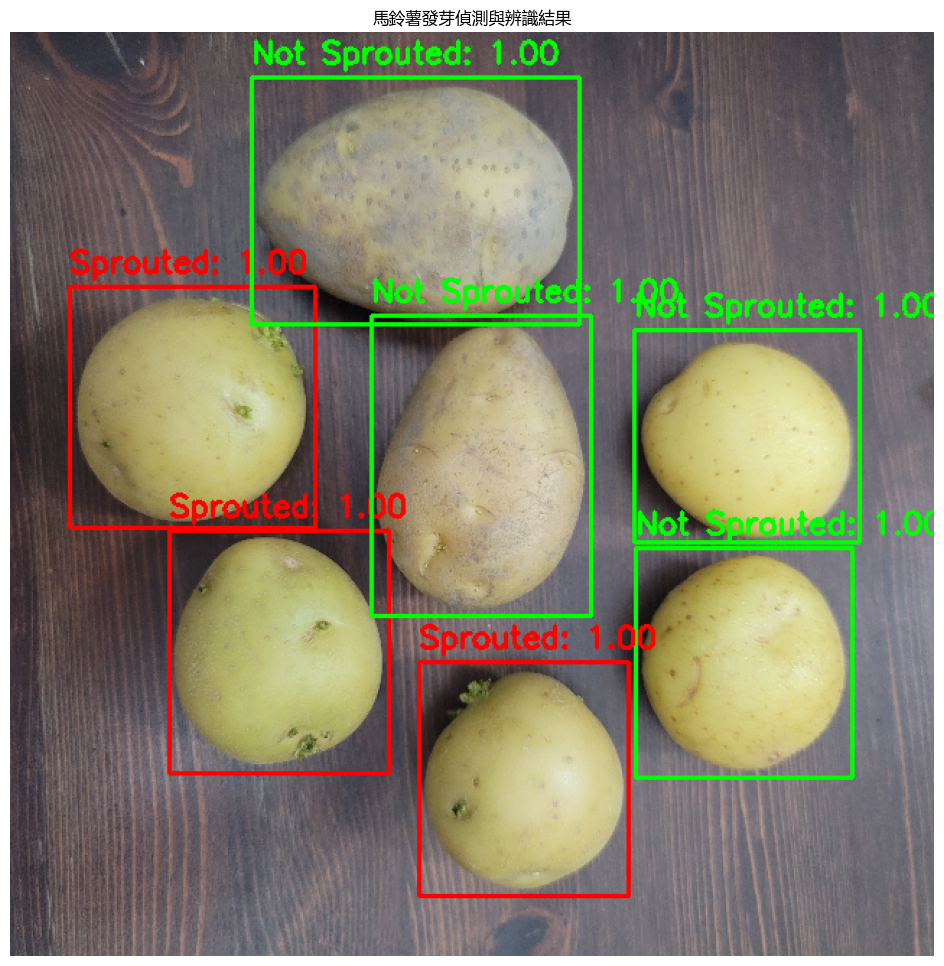

#### 馬鈴薯發芽辨識

##### 開發環境：

Python 3.9 , TensorFlow 2.10 , OpenCV, NumPy, Roboflow, Ngrok API, Line Bot

##### 專案成果：

1. 資料工程：自行拍攝與搜集網路圖片，建立並標記 1,009 張訓練資料集 (478張自攝 + 531張網路) 。因版權與檔案大小考量，未包含在此儲存庫中。
2. 模型訓練：使用 TensorFlow 進行二階段模型訓練，使用預訓練型與調整超參數，使模型的準確率達到 96%。
3. 結合 Roboflow 的物件偵測功能，讓模型透過攝影機實現即時偵測功能。
4. 透過 Ngrok 將訓練好的模型部署 Web 服務，並串接 Line Bot API，做出使用者可上傳圖片即時辨識的聊天機器人。

